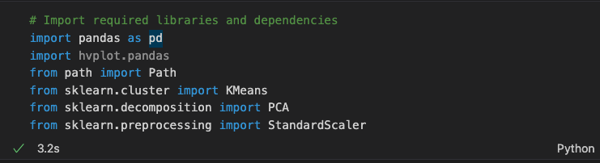
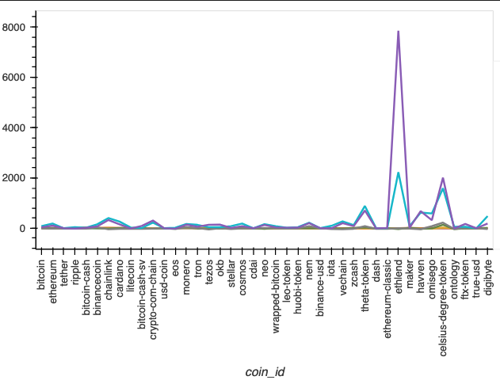
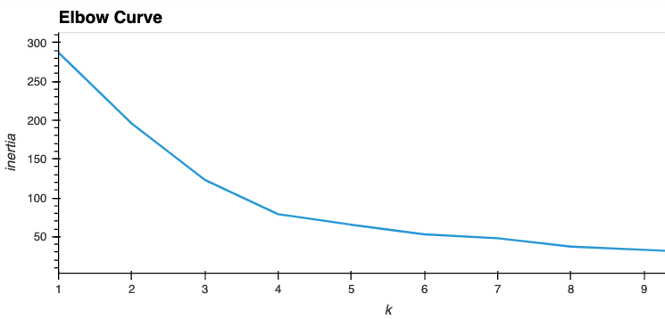
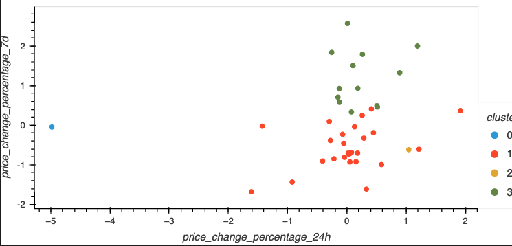
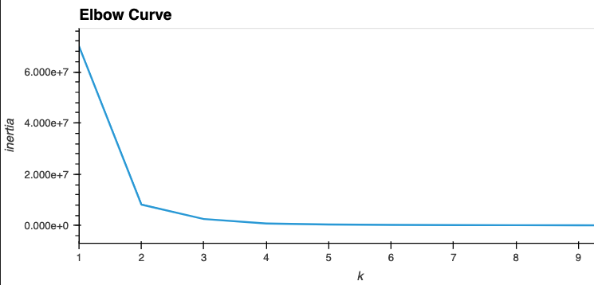
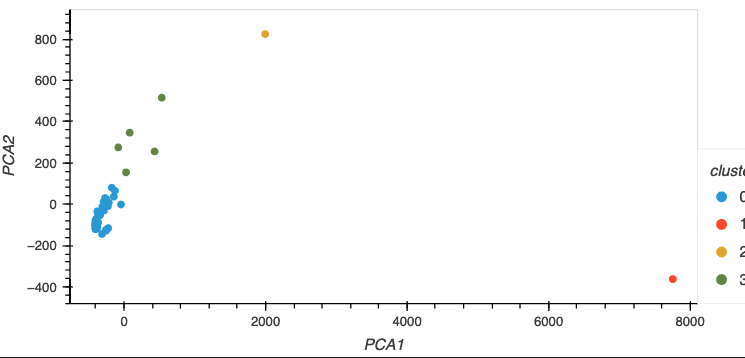

# Crypto Cluster Analysis
An unsupervised ML crypto price-change analysis using k-means and Prinicpal Component Analysis.

---

## Technologies

This application runs in a Jupyter notebook.  Once launched, it imports the following:

## Use

After reading in the Crypto Market Data (Resources/crypto_market_data.csv), the notebook creates a table and a graph showing price changes over different periods.

Then, the data is scaled for use in the K-Means algorithm using fit-transform.

An elbow curve is generated to determine the best k for the dataset.  

Using 4, a scatter plot is generated that shows the 4 clusters.

In order to improve on the selection of the number of clusters, a PCA model is used.

That generates the following Elbow curve.

Again, 4 seems to be the appropriate number of clusters.  Again, a scatter plot is generated.

---

## Contributors

This project was created as a part of the Rice FinTech Bootcamp by Charles Brown, Jacob Burnett, Kevin Gross, Ann Howell.

---

## License

This software is licensed for use under the included MIT License.
